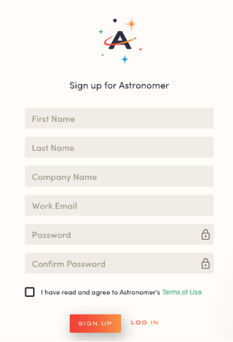
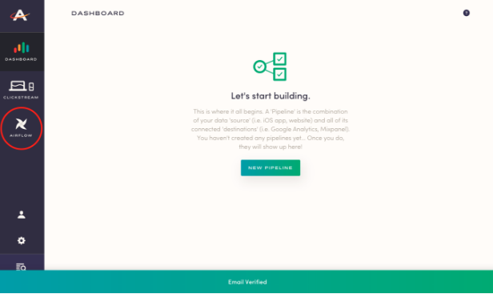
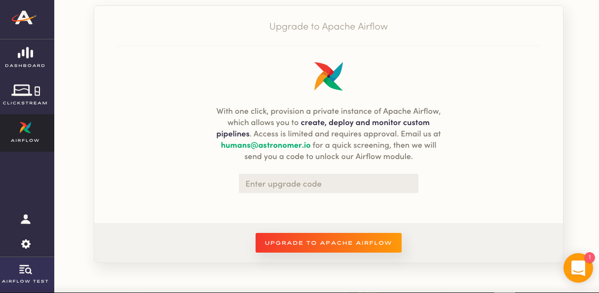
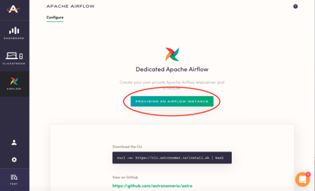
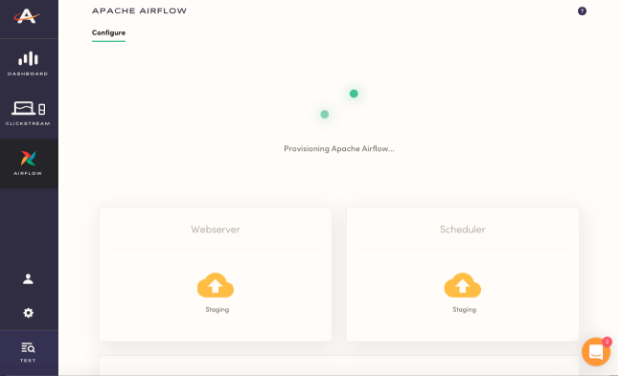
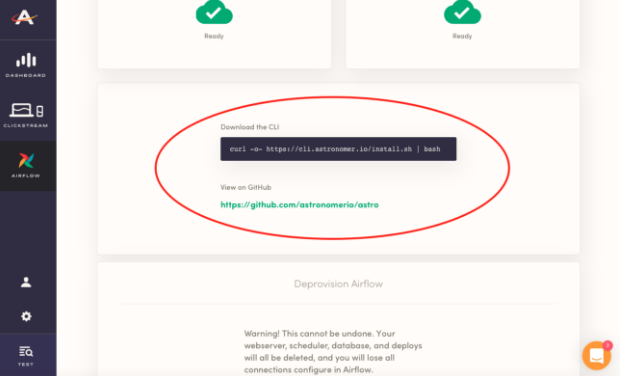

# Astronomer Airflow Set-Up Instructions

## 1. Sign up at app.astronomer.io 

Once you've verified your email address, you'll be set to log in. 




## 2. Click into our Airflow module

To provision an instance, go right ahead to the Airflow tab on the left side bar of our interface.

 

## 3. Enter your Upgrade Code

If you've reached out to our sales team to access our Airflow beta program, you should have received an upgrade code.

If you haven't been in touch with our team, reach out to R. Brad Kirn at brad@astronomer.io. He'll get you set up. 




## 4. Provision an Airflow Instance

Now that you've made it in, go ahead and create your own private Apache Airflow Webserver and Scheduler.



## 5. Wait for Webserver and Scheduler to Start

It'll take a couple of seconds for your Webserver and Scheduler to start kickin'. You should see both icons first turn yellow ("Staging") and then green ("Running").



### 6. Run the CLI (Command Line Interface) Install Script

*iOS or Linux users*: Download the CLI by copying this into your Terminal command line: 

```
curl -o- https://cli.astronomer.io/install.sh | bash
```

*Windows users*: Check out our [GitHub READ-ME](https://github.com/astronomerio/astro) to manually download the CLI. 

[Here's](https://docs.astronomer.io/v2/apache_airflow/cli.html) more documentation on our CLI. 



## 7. Sign into the CLI 

## 8. Push DAGs

With that, you're all set up to start pushing DAGs. Don't know where to start? Check out these docs: 

- [DAG Example](https://docs.astronomer.io/v2/apache_airflow/tutorial/sample-dag.html)
- [DAG Deployment Documentation](https://docs.astronomer.io/v2/apache_airflow/tutorial/dag-deployment.html)
- [DAG Writing Best Practices](https://docs.astronomer.io/v2/apache_airflow/tutorial/best-practices.html)
- [Airflow Connections Documentation](https://docs.astronomer.io/v2/apache_airflow/tutorial/connections.html)

Not finding what you're looking for? Reach out to our team at support@astronomer.io


