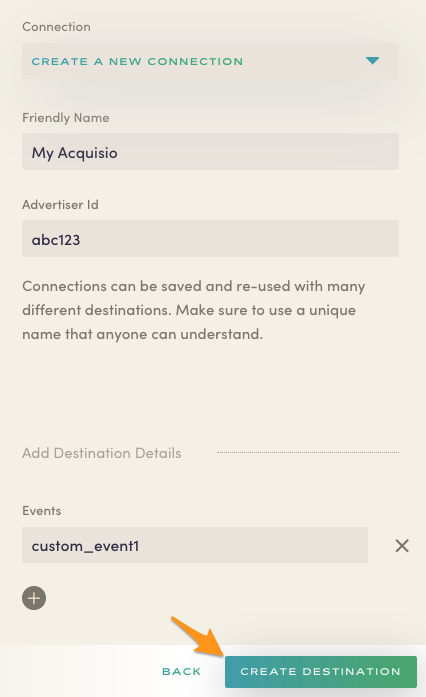

Astronomer Clickstream makes it easy to send your data to Acquisio. Once you follow the steps below, your data will be routed through our platform and pushed to Acquisio in the appropriate format. Note that this connector supports client-side analytics.js only.

## What is Acquisio and how does it work?

Acquisio is a machine learning platform for SMB advertising. It combines self-improving bid and budget technology with automation to optimize performance across digital marketing campaigns. 

By tracking the efficiency of your search engine marketing/PPC campaigns, Acquisio saves time and creates a higher level of marketing efficiency by supplying powerful A/B testing tools, ad-building tools, and an analytics dashboard.

[Learn more about Acquisio](https://www.acquisio.com/)

## Why send data to Acquisio using Astronomer Clickstream?

Having your user event data incorporated into your marketing automation can be invaluable. Knowing exactly how your users are interacting with your site and mobile appplications can provide more robust A/B experimentation results, generate insights regarding ad effectiveness, and highlight your customer acquision data.

## Getting Started with Acquisio and Astronomer Clickstream

### Acquisio Side

To get started sending events to Acquisio, you'll need to sign up for [Acquisio](http://www.acquisio.com/) and work with an account manager to:

* Create your company's specific campaign
* Receive your `Advertiser ID` and any custom event names

### Astronomer Side

Once you receive your `Advertiser ID` from your account manager, paste it into the `Advertiser ID` field in the Astronomer UI.  In the `Events` area, paste in any conversion event names given to you by Acquisio.  If you have more than one custom event, choose the `+` icon to add more.

With your configuration entered, choose `Create Destination.`

Generate page views and events on your website by triggering `analytics.track('your custom event name');`.  Confirm with your Acquisio account manager that custom events for your specific campaigns are being received as expected.
