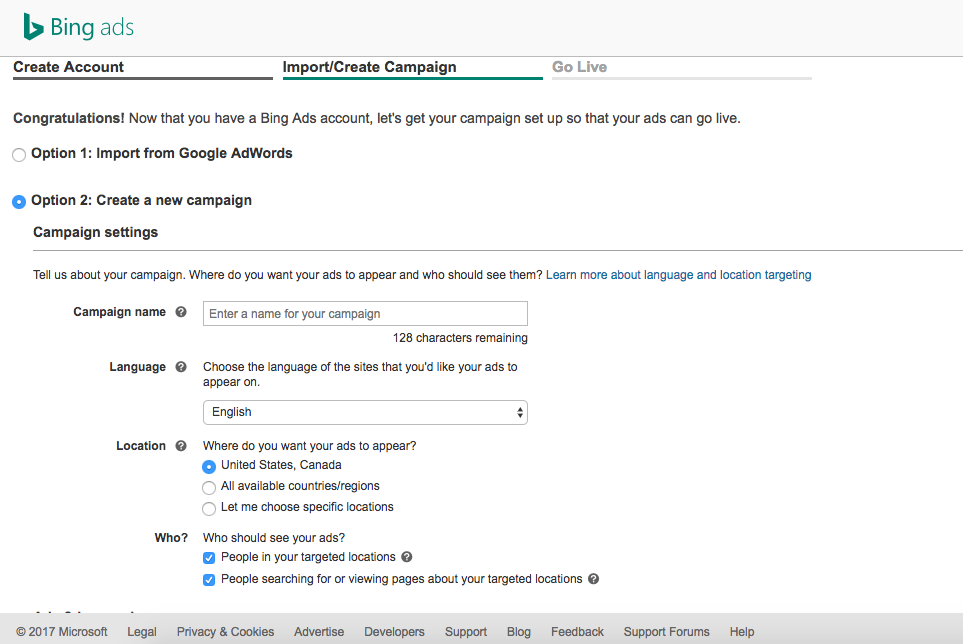
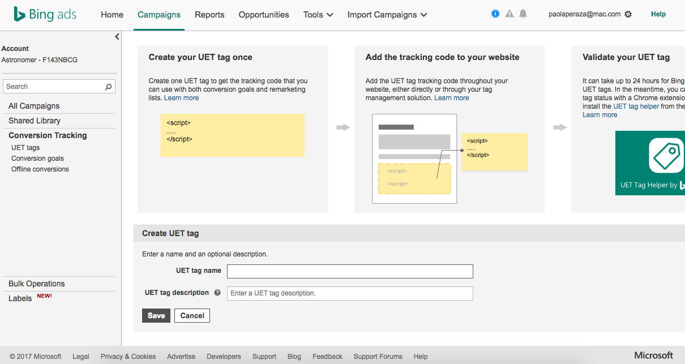
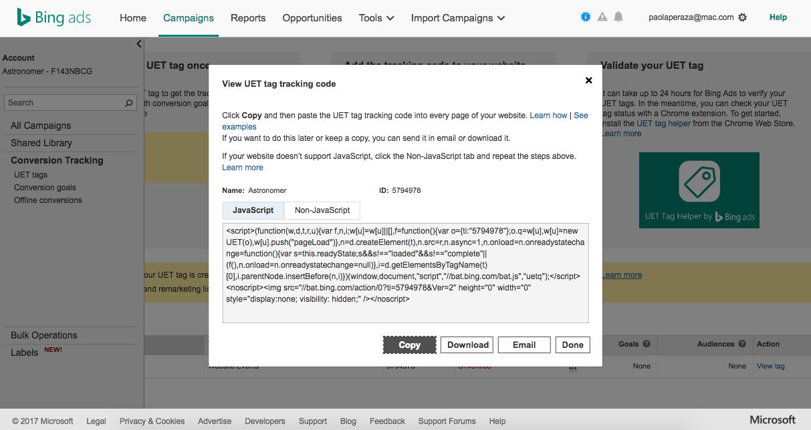

Astronomer Clickstream makes it easy to send your data to Bing Ads. Once you follow the steps below, your data will be routed through our platform and pushed to Bing Ads in the appropriate format. 

## What is Bing Ads and how does it work?

Bing Ads is a pay-per-click search engine tool that engages customers searching for and looking at your products and services on Bing, Yahoo, and MSN. Bing's network spans millions of unique searchers all over the world, but you can target specific users by city, country, or distance. Ads can also be configured to prompt users to call you or visit your site as soon as they see an ad or perform a certain action. If you're already using another product like Google Ads, it's easy to import that campaign directly into Bing Ads. 

Cost-wise, Bing Ads is both exceptionally accessible and adaptable to your needs. They charge per click without a minimum fee and allow you to adjust your budget at any time depending on your team's business needs. 

[Learn more about Bing Ads](https://secure.bingads.microsoft.com/).

## Why send data to Bing Ads using Astronomer Clickstrem?

With Astronomer Clickstream, send page and event data to Bing Ads without having to edit code. Once you enable our pipelines, our script will immediately load on your website to start collecting page views and recording events. Events that have a `value` or `revenue` property directly translate to Bing Ads' event value.

## Getting Started with Bing Ads & Astronomer Clickstream

Bing Ads will record all of your pageviews and events sent via `page` and `track`, giving you access to data that you can use to create custom goals and conversions directly on Bing Ads. 

*Note*: Bing Ads is available as a client-side destination only. 

### Bing Side 

To set up your pipeline, you'll need to create your Bing Universal Event Tracking (UET) `Tag ID`. This tag will help you track campaign performance by counting unique conversions and letting you associate multiple conversion goals under a single account.

To do so, first create an account and make a campaign. Here, you'll also have the option to import a Google AdWords campaign.

. 

Once you create a campaign, you'll be taken to your `Campaign` page. On the lefthand bar, click on `Conversion Tracking` > `UET Tags`. 

Now, go ahead and create a UET Tag by choosing a name and description. 

. 

If you click on `View Tag`, you'll be able to see both the code and the ID. With that.

. 

For more help on getting Bing Ads set up, check out [this Bing Ads support page](http://help.bingads.microsoft.com/apex/index/3/en/56705). 

### Astronomer Side 

If you're ready with your `Tag Id` at hand, go ahead and log into your Astronomer dashboard. 

Add Bing Ads as a destination. From there, give your connection a unique name and input your `Tag Id` where prompted. 

Now, just click on `Create Destination` to activate your pipeline. 

That's it! Get ready for insights. 

