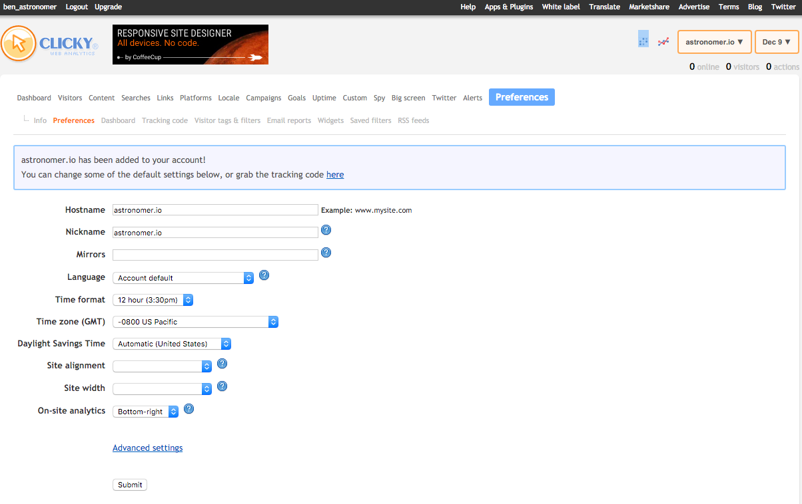

Astronomer Clickstream makes it easy to send your data to Clicky. Once you follow the steps below, your data will be routed through our platform and pushed to Clicky in the appropriate format. 

## What is Clicky and how does it work?

Clicky is a real-time web analytics tool that supports user segmentation, allowing marketers to define and track customers based on unique constraints. It enables an intuitive heatmap view so that users can analyze and discover where users are clicking on their website. It also allows on-site analytics to track total visitors on site, pages viewed, and user actions. 

Clicky is used for optimizing traffic sources, engaging users with content, and increasing conversion rate. It allows you to enrich your visitor data with personal user data like names and email addresses. To use Clicky natively, you must add their JavaScript snippet to every page on your web application. Setting up custom goals and identifying users is more complex and requires custom code and an understanding of the Clicky API.

[Learn more about Clicky](https://clicky.com/)

## Why send data to Clicky using Astronomer Clickstream?

Integrating Clicky with Astronomer Clickstream avoids the painstaking process of installing the Clicky JavaScript library on each page of your site. Once you enable Clicky in your Astronomer UI, this JavaScript library will be automatically loaded into each page and you will begin collecting user information. 

## Getting Started with Clicky and Astronomer Clickstream

### Clicky Side 

Once you've made an account with Clicky, you will land on a page outlining basic information. Click the blue 'Preferences' button on the right side of the main menu bar.

Your site ID will be at the top of this page. Copy this ID to your clipboard.

### Astronomer Side

Paste this ID into the Astronomer UI to begin sending data to Clicky. Your pipeline will be activated once you click 'Save.'

