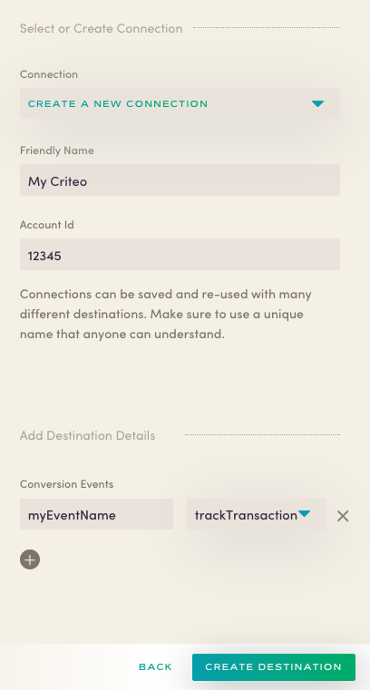

Astronomer Clickstream makes it easy to send your data to Criteo. Once you follow the steps below, your data will be routed through our platform and pushed to Criteo in the appropriate format.

## What is Criteo and how does it work?

Criteo is a digital advertising and retargeting tool that automates, optimizes, and places Google Shopping ad campaigns in front of 1.2 billion monthly users. It also enables the creation and placement of native ads on retail sites using "Brand 360," an attribution feature that uses closed-loop SKU-level sales data, allowing advertisers to track sales outcomes. It is capable of retargeting dynamic ads across Facebook and Instagram using machine learning to analyze user behavior and suggest products to customers.

In order to track key conversion events, Criteo requires the installation of their JavaScript library into your site. Implementation of Criteo tags will require effort from your mobile developer team.

[Learn more about Criteo](https://www.criteo.com/)

## Why send data to Criteo using Astronomer Clickstream?

Integrating Criteo with Astronomer Clickstream eliminates the need to add any Criteo code tags to your application. Once you enable Criteo in your Astronomer UI, you will be able to automatically route all your date directly to Criteo from our servers.

## Getting Started with Criteo and Astronomer Clickstream

### Criteo Side

To get started sending events to Criteo, you'll need to have signed up for [Criteo Remarketing](http://www.criteo.com/) and working with a Criteo Account Strategist to plan your remarketing campaign.  You'll need a few technical components from your Account Strategist to move forward with enabling this connector. Note that this destination supports the client-side analytics.js source only.

Begin by retrieving and deploying the latest version of Criteo's loader file (a `.js` file that should get loaded into your page by your servers).  You'll also need your remarketing campaign tags to enable tracking with Astronomer.

Once your loader `.js` file is deployed on your page, you'll be ready to configure the Criteo connector within your Astronomer UI.  

### Astronomer Side

Copy your Criteo Account ID into the "Account ID" field in your Astronomer Criteo configuration, and give your new connection a unique name. Your pipeline will be activated once you click 'Save'.

## Beyond the Basics

You can also map custom event names to a few of Criteo's reserved keywords in the Conversion Events section. In the example shown, `myEventName` is a custom event mapped to Criteo's `trackTransaction`.

