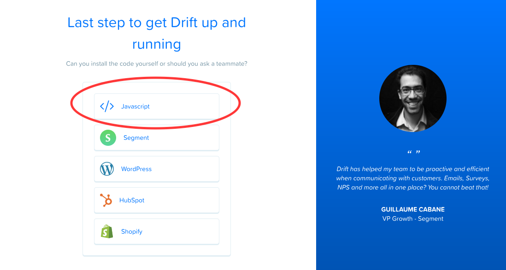
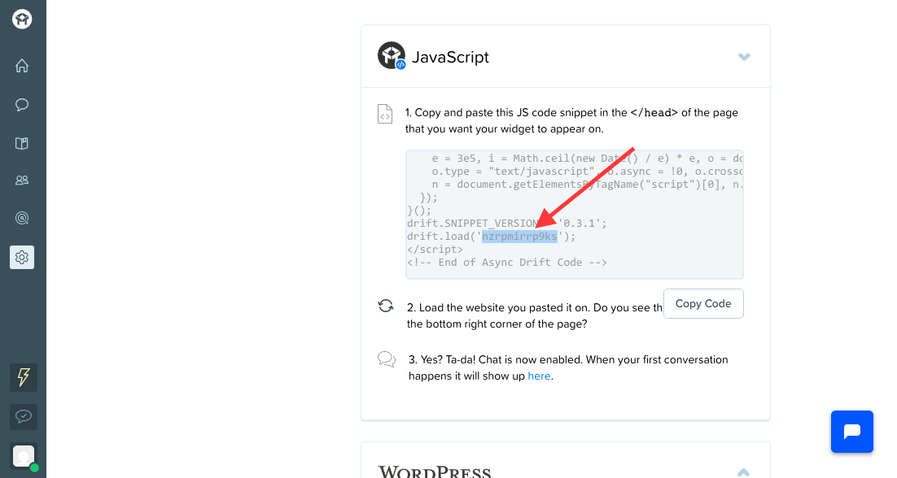
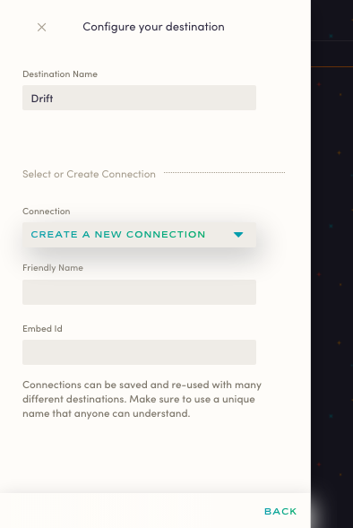

Available for all client-side sources, Astronomer Clickstream makes it easy to send your data to Drift. Once you follow the steps below, your data will be routed through our platform and pushed to Drift Events in the appropriate format.

## What is Drift and how does it work?

Drift is a conversational marketing and sales platform that powers enriched live chat and customer messaging.

Instead of traditional platforms that rely on forms and follow-ups, Drift connects your business with the best leads in real-time, almost like a virtual assistant at scale. Specific triggers or topics automatically route conversations to appropriate agents, making for effective conversations that lead to conversions and closed deals. Plus, the behavioral data that comes out of this feature becomes incredibly valuable for customer segmentation and targeted messaging. Lastly, Drift can integrate with a variety of help-desks, CRMs, and collaboration tools so chat messages are enriched with relevant user data. 

[Learn more about Drift](https://www.drift.com/)

## Why send data to Drift using Astronomer Clickstream?

With Astronomer Clickstream, you won't have to worry about manually installing Drift on your site. Once you activate our integration, the chat widget will load on your website and Astronomer event data will automatically start flowing to Drift.

Astronomer's integration allows your team to leverage Drift's technology without the manual headache, getting you straight to insights.

## Getting Started with Drift and Astronomer Clickstream

Astronomer's Drift destination supports the Drift JavaScript SDK as well as data collection through `identify`, `track`, `page`, `screen,` and `group` methods.

### Drift Side

Once you have an account on Drift, you'll be prompted with a few install options. The only thing we're looking for here is an `Embed Id`, which is what you need to input on your Astronomer dashboard. To retrieve the Id, you can either reach out to the support team directly, or find it yourself within the JavaScript snippet.

If you decide for the latter, go ahead and click on JavaScript when prompted. In that code, the Embed Id will be within text that reads `drift.load ('<Embed Id here>')`.

Check out the image below for reference:

### Astronomer Side

With that `Embed Id` in hand, jump right to your Astronomer dashboard and add Drift as a destination to client-side source.

Give your connection a unique name enter your `Embed Id` as seen below:

Now, just click `Create Destination` to activate your pipeline.

With that, you're all set! Get ready for insights.
