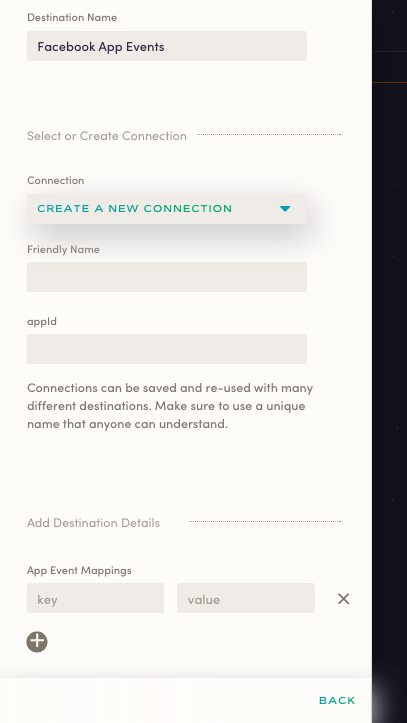

Available for server-side and mobile sources, Astronomer Clickstream makes it easy to send your data to Facebook App Events. Once you follow the steps below, your data will be routed through our platform and pushed to Facebook App Events in the appropriate format.

## What is Facebook App Events and how does it work?

Adding app events to your app or website helps you learn more about your audience and the actions people take across channels within Facebook Analytics. Plus,you can use app events to:

- Measure your mobile app ad performance
- Build Custom Audiences
- Optimize mobile app engagement ads

Facebook App Events are powered by Facebook SDK's that you'll have to separately install and configure in your iOS and Android apps. Facebook also has a Javascript library for collecting events from your site code. 

It's also worth noting that Facebook has a standard set of events that need to be installed for various industry verticals. Otherwise, Facebook supports custom events so that your team can add location, and event details for promotion purposes.

[Learn more about Facebook App Events](https://developers.facebook.com/docs/app-events)

## Why send data to Facebook App Events using Astronomer Clickstream?

With Astronomer Clickstream's Facebook App Events integration, you won't need to write custom code or bundle Facebook SDK's. Just integrate one of Astronomer's latest mobile SDK's into your app and we'll send all the data we collect to Facebook via our servers. Plus, you'll be able to map any of your existing Astronomer events to other Facebook App Event event names, and user traits like birthday, city, gender, etc. get passed directly through to [Facebook Pixel](facebook-pixel.md)

In short, skip the manual headache and get straight to insights with Astronomer Clickstream. 

## Getting Started with Facebook App Events and Astronomer Clickstream

### Facebook App Events Side

Once you have a Facebook Apps account, all you'll need to do is retrieve your 15-digit App ID. You can find this directly on your [dashboard](https://developers.facebook.com/apps/). 

Once that's set, you'll need to know what specific events you want to map. For each event, we'll ask you for the event *key* (e.g. `Products Searched`) as well as the *value* (e.g. `fb_mobile_search`).

### Astronomer Side

Now that you have what you need from the Facebook Apps side, go ahead to your Astronomer [dashboard](https://app.astronomer.io/login). 

Input your `appid` and App Event Mappings. 

As a final step, give your destination a unique name in the `Friendly Name` box. 

With that, just click on `Create Destination` to active your pipeline!

