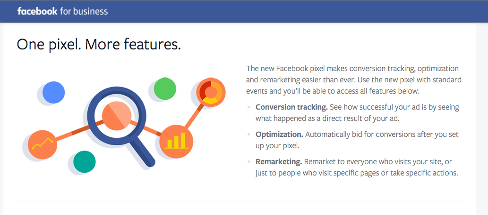
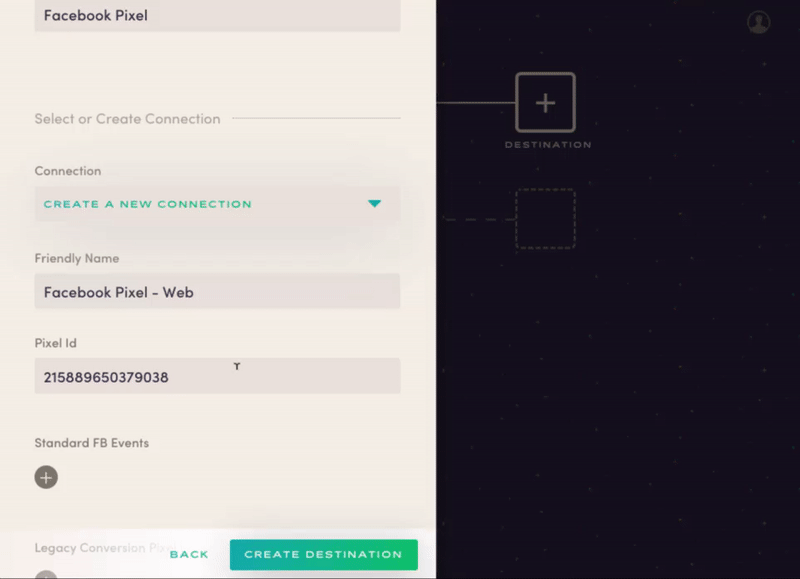

Astronomer Clickstream makes it easy to send your data to Facebook Pixel. Once you follow the steps below, your data will be routed through our platform and pushed to Facebook Pixel in the appropriate format.

***Note:** Astronomer's Facebook Pixel destination consolidates what was previously Facebook's "Ads for Websites" suite, which consisted of both Facebook Custom Audiences and Facebook Conversion Tracking.*

## What is Facebook Pixel and how does it work?

Facebook Pixel is an Ad system designed for conversion optimization and lead tracking. It allows you to manage all of your ads from one platform and uses prospecting tools to target your ads to lookalike audiences. By providing this dynamic service, Facebook Pixel allows marketers to optimize cross-platform ads for custom conversions and see when users view content, search for a product, interact with their wishlist, or add payment info.

Facebook Pixel uses a JavaScript Tag API to track audiences and custom user events like page visibility and page length. In order to be used, this JavaScript library must be added to every page of your site. It has a standard set of natively-integrated events such as product views, adds to cart, and purchases. While extremely extensible, tracking dynamic data like sku, name, and price from your database will require that custom code be added to your site.

## Why send data to Facebook Pixel using Astronomer Clickstream?

With Astronomer Clickstream, you can use Facebook Pixel without having to install their JavaScript library on every page of your site. We also eliminate the need to write custom code to track user event data. Once your Facebook Pixel is routed through Astronomer, our platform translates page views and events into corresponding Facebook Pixel events.

## Getting Started with Facebook Pixel and Astronomer Clickstream

### Facebook Pixel Side

To get started with this integration, you'll first need to create a Facebook for Business account. [Follow the instructions](https://www.facebook.com/business/a/online-sales/custom-audiences-website) for creating a Pixel.

You'll only create one pixel for your site (typically labeled with the name of your business). This pixel will [replace all the functionality](https://www.facebook.com/business/help/1686199411616919) previously given to Facebook Audiences and Facebook Conversions (as well as allowing some additional features, such as custom conversions).

Once that's set up, identify your unique `pixelId`, a 15 digit number that uniquely identifies your site.

### Astronomer Side

Put your Facebook Pixel ID into your Astronomer account and give your new connection a unique name.

**Standard Events**

Facebook has nine [Standard Events,](https://www.facebook.com/business/a/add-pixel-standard-events) which are predefined within the Facebook for Business platform.

To connect your events to these predefined ones within Facebook, just input the name of the Astronomer event and choose the appropriate Standard Facebook Event that corresponds to it.

**Conversion Pixel ID**

If you are using the Facebook Pixel integration as a replacement for Conversion Pixels as well, put each `Conversion Pixel ID` into your Astronomer account next to the corresponding event in Astronomer that you've already set up. Make sure you include all capitals letters and spaces used in your event labels.

With that, just click `Create Destination` to activate your pipeline.
