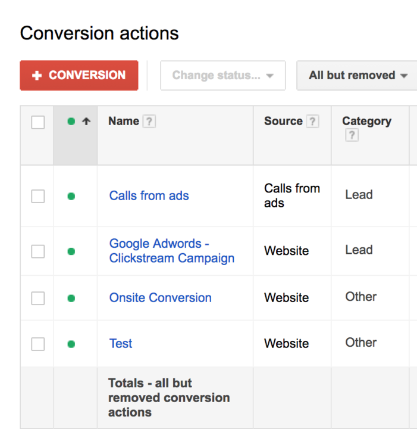
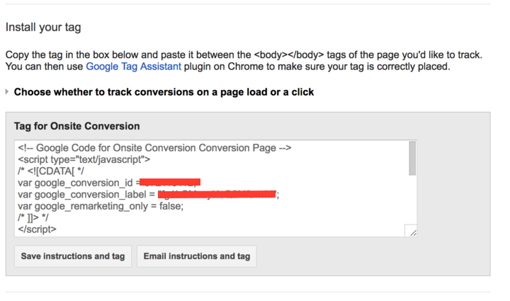

Astronomer Clickstream makes it easy to send your data to Google AdWords. Once you follow the steps below, your data will be routed through our platform and pushed to Adwords in the appropriate format.

## What is Google AdWords and how does it work?

Google AdWords is a pay-per-click ad platform for Google Search. It operates by placing advertisements across text-based searches, graphic displays, YouTube videos, and in-app mobile displays. It also is able to target custom ads based on country, city, region, or distance from the location of the advertiser.

AdWords operates by installing code snippets on your site that trigger conversions or tag visitors for remarketing. It uses a `page` call to gauge these conversions and tags, and does not natively have an easy way to fire events based on user actions other that page loads.

Furthermore, if you want to use AdWords in your mobile apps, you'll need to learn their SDK and tag your app with custom events.

[Learn more about Google AdWords](https://adwords.google.com/home/)

## Why send data to Google AdWords using Astronomer Clickstream

Integrating AdWords with Astronomer allows you to use your existing tracking events (check out our [API Calls](../calls.md)) to trigger conversions and remarketing tags. We also allow you to incorporate multiple remarketing tags using the conversion label identifier.

Furthermore, you do not need to learn the AdWords SDK methods if you want to send data from your mobile apps. You will also not need to re-submit to the app store, as everything can be handled by Astronomer. We take care of pulling the data from your apps and sending it to AdWords.

## Getting Started with Google AdWords and Astronomer Clickstream

### Adwords Side

Once you create an Adwords account, you'll need to find your Conversion ID. To do this, you'll need to navigate through `Tools-->Conversions` and have to click the red `+ Conversion` button.

Copy the Conversion ID to your clipboard.

### Astronomer Side

Once you've obtained your Conversion ID, copy and paste it into the corresponding field in your Astronomer UI. You can now enable the pipeline and watch your data flow into AdWords!

### Additional Features

You are also now able to click a `Remarketing` checkbox. If you enable this feature, Astronomer sends an additional remarketing tag for each of your conversion labels and for every `page` API call. 

Since AdWords recognizes labels rather than custom events, you'll need to map the `event name` to its corresponding `AdWords label` in the appropriate fields.

