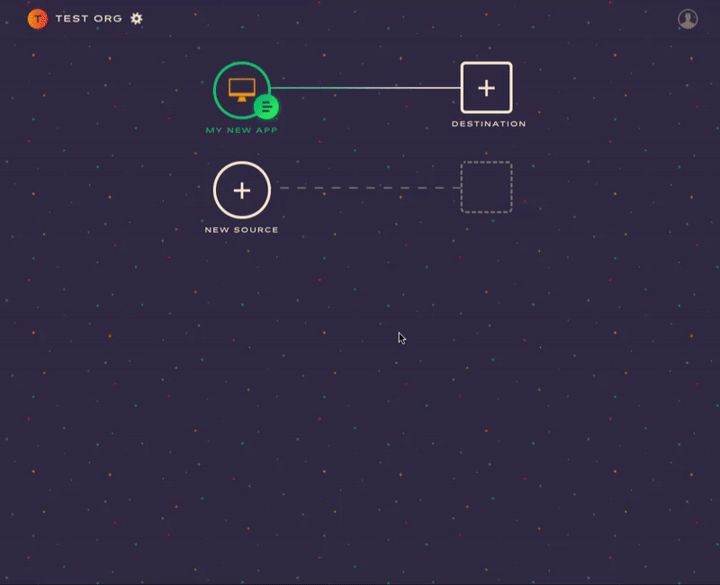

Astronomer makes is easy to send your data to Google Analytics. Once you've set up your source to start tracking data, we'll translate and route that data to Google Analytics.

## What is Google Analytics and how does it work?

Google Analytics is a web analytics tool that pools real-time site information for a comprehensive view into user acquisition, audience demographics, and conversion goals. It supports targeted audience and integrates seamlessly with Google AdWords and all DoubleClick products.

Google Analytics requires that you add their snippet to your site. Doing this will give you basic information such as page views, traffic sources, and user location.  If you want to get more detailed user information, you'll need to write custom code in your site. In order to do this, you'll need to have a developer study the Google Analytics API to learn how to implement methods and format data correctly.

## Why send data to Google Analytics using Astronomer Clickstream?

Integrating Google Analytics with Astronomer Clickstream means that you do not need to install any Google Analytics code into your site or mobile app. It also greatly eases the processes of tracking more detailed information like what users are doing on a page, e-commerce data, and user attributes. Furthermore, many custom events can be configured directly in the Astronomer UI, making it easy to track the data that you need.

## Getting Started with Google Analytics and Astronomer Clickstream

*Before you get started, note that you will need to remove Google Analytics snippet from your page if you were using it outside of Astronomer.*

### Google Analytics Side

To start, you'll need your Google Analytics `Tracking ID`. This can be found in the Admin panel and should abide by the following structure: `UA-XXXXXXXX-X`.

### Astronomer Side

Next, head to app.astronomer.io and add a new destination for the source you want to track. Select Google Analytics and you will be brought to a Configure your destination panel.

Here, you'll need to create a Friendly Name and enter your Google Analytics Tracking ID for the application. With just these two pieces of information, you can click `Create Destination` and Astronomer will start sending your Clickstream data to Google Analytics.

***Note:** Unless you specify otherwise, Astronomer will automatically enable `Track Named Pages` and `Track Categorized Pages`.*

Enabling Google Analytics in your Astronomer UI causes a few things to happen:

  * Within a couple of minutes, our CDN is updated and our snippet will start loading Google Analytics JavaScript library onto your web pages. Note that it typically takes 12-24 hours for events to begin populating your GA dashboard, but then events should populate in real-time.

  * Your Google Analytics real-time dashboard will start showing live visitors.

  * Any iOS or Android apps running our mobile libraries will start sending data to Google Analytics. New setting will take up to an hour to propagate to all of your existing users. If you added the iOS or Android library to your application code, it should take 12-24 hours for events to begin populating your dashboard.

  * Google Analytics will start automatically collecting data on your site or mobile app. It takes Google a couple of hours to process this data and add it to your reports, but you should still see events showing up in the real-time events dashboard.

## Additional Functionality

### Page & Screen
For every `page` call, we send a page view to Google Analytics. The resulting `page` event name in Google Analytics will correspond to the `fullName` of your page event. `fullName` consists of a combination of the `category` and `name` parameters of `page` calls.

Note that when sending `page` views from a server-side library, a `url` property is required for Google Analytics to accept your `page` event.

Also note that when calling `screen` in a mobile app, we'll send a screen view to Google Analytics but when calling `screen` server-side, you must pass in an application name through the `context.app.name` object for Google Analytics to accept your event.

If you've set an application name in your Android or iOS project, Astronomer will grab the name and pass `context.app.name` automatically. For iOS, we collect your project's `infoDictionary` and use whatever name you've set there.

### Identify
Since it's against Google's [Terms of Service](https://www.google.com/policies/terms/) to send Personally Identifiable Information (PII) to your Analytics reporting interface, we will never pass anything from an `identify` to Google unless you specifically tell us to.

#### User ID
Google Analytics allows you to set a User-ID for your identified visitors. [Read more about their universal tracking method here.](https://support.google.com/analytics/answer/3123663)

To utilize this feature, you'll need to enable User-ID in your Google Analytics property and [create a User-ID view.](https://support.google.com/analytics/answer/3123666)

### Track
We'll record a Google Analytics event whenever you make a `track` call (see events in Google Analytics in Behavior -> Events -> Overview).

## Beyond the Basics
As mentioned above, Astronomer will automatically enable `Track Named Pages` and `Track Categorized Pages`. You'll notice that there a quite a few other Destination Details. Keep reading to learn what those are and why you might want to use them.

### Use Classic Analytics on Your Site
When creating your Google Analytics profile, you can choose between Classic and Universal Analytics. Profiles created after March 2013 default to Universal while earlier profiles are Classic.

To check your version, look for `_gaq.push` in your code. If you see it, you're using Classic and will need to enable this.

### remarketing, Display Ads, and Demographic Reports
Turn this feature on to use Google's remarketing tag (what was formerly known as DoubleClick) or to identify demographic and interest data on visitors that is displayed in Demographic & Interest reports in Google Analytics.

### Cookie Domain Name
In Google Analytics, the Cookie Domain Name setting allows you to specify the domain that the `_ga` cookie will be set on (this defaults to the top level domain: `domain.com`).

With Clickstream, the Cookie Domain Name defaults to `auto` which sets the cookie at root domain level. This will allow you to track across multiple sub-domains but will not work on `localhost` so, if you need to test on `localhost` but don't need to track between multiple sub-domains, then you can set the domain to `none`.

If you only want the cookie to live on a single sub-domain, enter that sub-domain the Cookie Domain Name field.

### Enable Enhanced E-commerce
This feature enables more detailed reports on e-commerce.

### Ignored Referrers
Use this if you want Google Analytics to ignore certain referral domains.

***Note:** This only works for Classic profiles. If you are on a Universal profile, you can edit this feature directly inside Google Analytics.*

### Track Named Pages
Enabling this will track events to Google Analytics for `page` calls that have a `name` associated with them. For example, `page('Home')` will translate to **Viewed Home Page**.

***Note:** We enable this automatically when you set-up Google Analytics as a Clickstream destination.*

### Track Categorized Pages
Enabling this will track events to Google Analytics for `page` calls that have a `category` associated with them. For example, `page('Blog', 'Index') will translate to Viewed Blog Page.

***Note:** We enable this automatically when you set-up Google Analytics as a Clickstream destination.*

### Include Querystring in Page Views
By default, we only send the domain and path to Google Analytics. Enable this feature if you would like to pass a whole URL with query string to Google Analytics. This is helpful when you would like to track search queries.

### Anonymize IP Addresses
Read more about anonymizing IP addresses for client-side libraries [here](https://support.google.com/analytics/answer/2763052?hl=en).

### Enable Enhanced Link Attribution
This feature provides more detailed reports on the links clicked on your site. Read more [here](https://support.google.com/analytics/answer/6047802?hl=en&visit_id=1-636437616467963863-2922769516&rd=1).

### Add the Non-Interaction Flag to All Events
This feature adds a `noninteraction: true` flag to every event tracked to Google Analytics. Enable this if you're seeing unusually low bounce rates.

### Site Speed Sample Rate
This defines the sample size for Site Speed data collection. If you have a smaller number of visitors, you might want to adjust the sampling to a larger rate for your site speed stats.

### Use Classic Analytics for Your Server-side Tracking
When creating your Google Analytics profile, you can choose between Classic and Universal Analytics. Profiles created after March 2013 default to Universal while earlier profiles are Classic.

### Send User-ID to GA
**Important** If you are passing an email, phone number, full name, or any other PII as the `ide` in identify, do not use this feature as it is against the Google Analytics Terms of Service and your account could be suspended.

### Send Uncaught Exceptions to GA (Mobile)
This feature lets you study errors and exceptions in your iOS and Android apps in Google Analytics.
