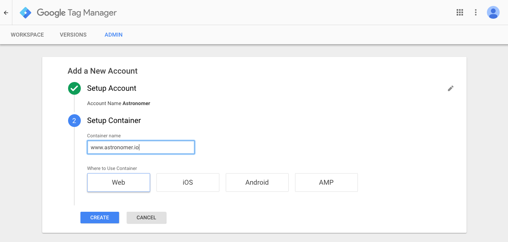
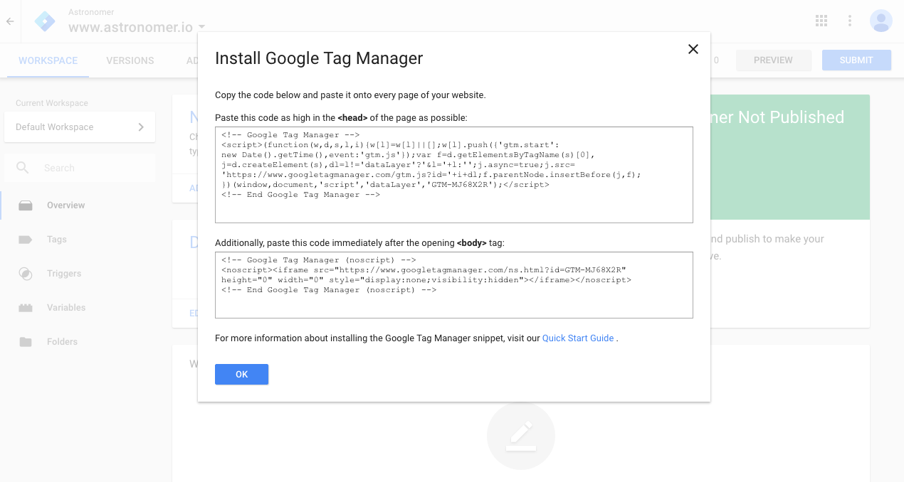
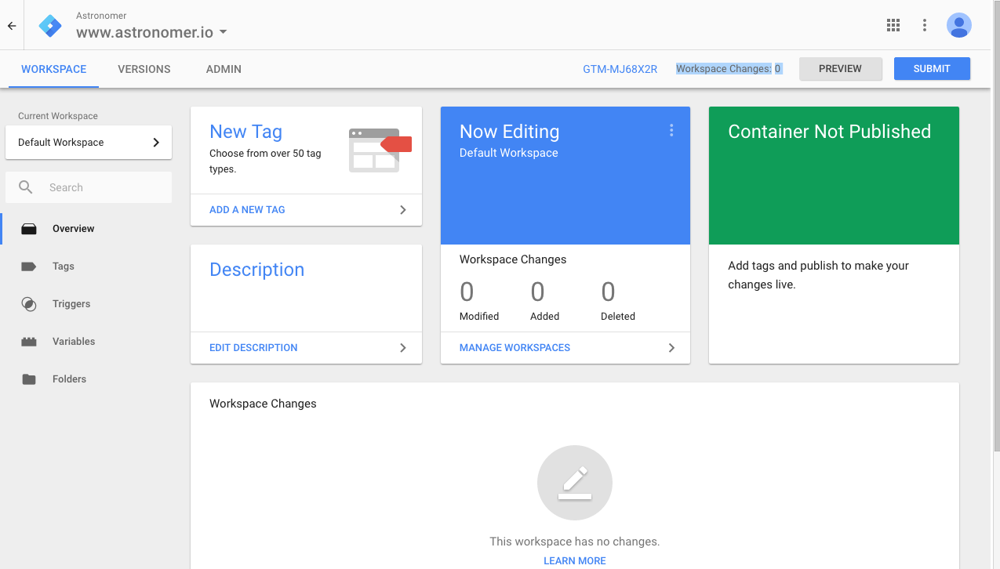
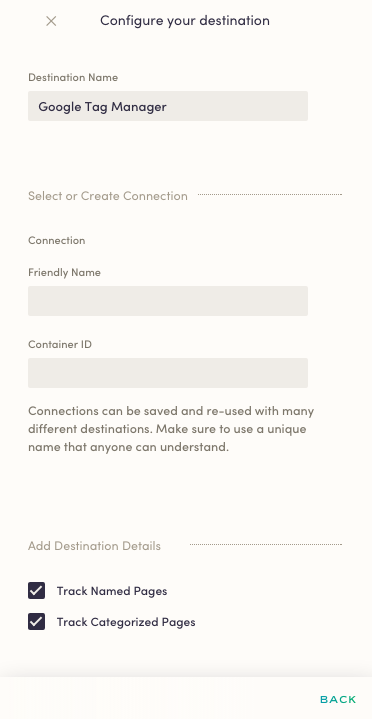

Available for client-side sources, Astronomer makes it easy to send your data to Google Tag Manager. Once you've set up your source to start tracking data, we'll translate and route that data to Google.

## What is Google Tag Manager and how does it work?

Google Tag Manager (GTM) helps make tag management simple, easy, and reliable by allowing marketers and webmasters to deploy website tags all in one place. With Tag Manager, maximize your agility by adding and updating your own tags for conversion tracking, site analytics, and remarketing. Control when and how your tags fire with triggers and customize your infrastructure with the full-featured Google Tag Manager API.

Plus, GTM supports all Google and third-party tags, has built-in security and error-checking features, and boasts numerous tools aimed to increase collaboration across your business.

GTM works through a snippet that you'd normally have to include in all of your pages with content. This is a snippet of code that's meant to enable tag manager to fire tags by inserting `gtm.js` into the page.

[Learn more about Google Tag Manager](https://www.google.com/analytics/tag-manager/)

## Why send data to Google Tag Manager using Astronomer Clickstream?

With Astronomer's GTM integration, you won't have to worry about loading GTM's snippet onto every single one of your pages or installing SKDs for iOS and Android mobile apps. Instead, GTM will be automatically loaded onto any pages where your Astronomer snippet is initialized and your `analytics.js` page gets called in client-side JavaScript.

Astronomer's integration only requires the `Container ID` tied to your account. Skip the headache and get straight to insights.

## Getting Started with Google Tag Manager and Astronomer Clickstream

### Google Tag Manager Side

First, you'll need to sign up for a Google Tag Manager account directly on [GTM](https://www.google.com/analytics/tag-manager/) and create a new 'container' for your site.

You'll immediately be given a GTM container `snippet`. Since you're using Astronomer's integration and snippet, you can skip this step - just press `OK`.

You'll then be taken to your "Workspace". Look to the top right of that page to find your `Container ID` - formatted GTM-XXXXXX.

*Still need help setting up Google Tag Manager? Check out [this page](https://support.google.com/tagmanager/answer/6103696?hl=en).*

### Astronomer Side

Once you've identified your `Container ID`, go to your Astronomer dashboard and add 'Google Tag Manager' as a destination.

Input your `Container ID` and give your connection a unique name.

At the bottom, you'll also see an option to enable tracking for both named and categorized pages. Once that's set, go ahead and click `Create Destination` to activate your pipeline.

With that, you're all set!

### Things to Note.

Once you enable this pipeline, you'll be able to trigger Astronomer events by entering `analytics.track` or `analytics.page` calls into GTM.

***Note:** Don't forget to "publish" your GTM container before trying to load it with Astronomer.*
