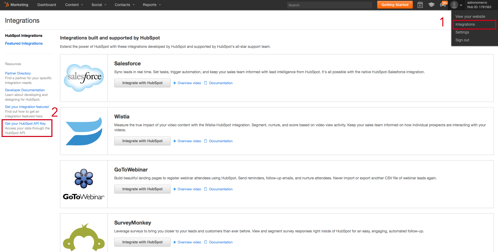
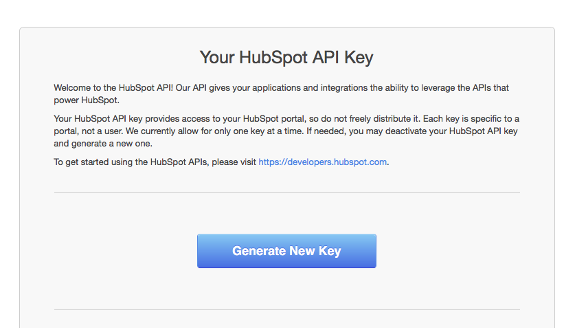
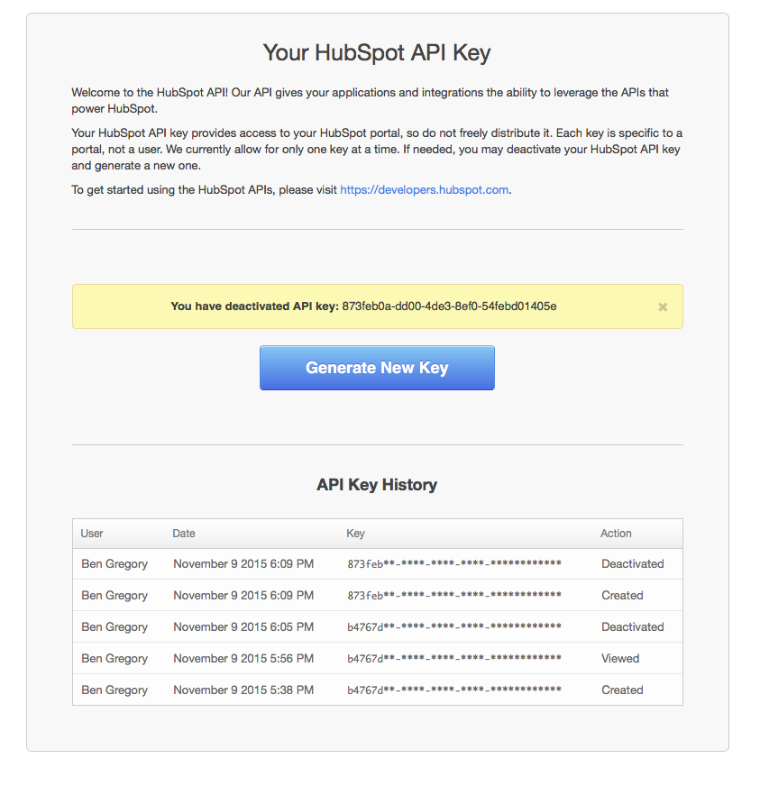

Astronomer Clickstream makes it easy to send your data to Hubspot. Once you follow the steps below, your data will be routed through our platform and pushed to Hubspot in the appropriate format. 

## What is Hubspot and how does it work?

Hubspot is a full-featured marketing automation platform that includes a landing page builder, tools for email and SEO, a form builder for gating content, and a repository for managing leads generated from specfic campaigns. It allows you to track the ROI of Facebook, AdWords, and LinkedIn advertising using an ad tracking component. It also tracks social media engagement with a monitoring tool that can schedule responses and outgoing social posts. 

Hubspot usually is used in tandem with another CRM, like Salesforce. This allows you to integrate multiple sources of truth in one location.

## Why send data to Hubspot using Astronomer Clickstream?

Using Hubspot with Astronomer Clickstream allows you to automatically keep all of the customer data in your HubSpot account up-to-date and accurate, rather than spending valuable time uploading lists or relying on lead forms to capture contacts. By enabling the Hubspot integration in your Astronomer UI, you can keep all customer data records synced and up-to-date accross multiple systems in real time.

## Getting Started with Hubspot and Astronomer Clickstream

To get started sending events to [Hubspot](http://www.hubspot.com), all you'll need is your Portal ID and API, both of which can be found shortly after you create an account.

**Getting Credentials from Hubspot:**

Create a Hubspot account via their [website](http://www.hubspot.com). After you go through the initial onboarding, you'll want to click on your account tab on the top right of the window. Note that you might notice something called a "Hub ID" next to the account tab. That's the ID you'll need for the Atronomer integration.

**Go to Settings->Configuration**

Select the "Integrations" option and you'll be brought to a screen that looks like the one below. Next, you'll want to click the option on the left hand menu labeled "Get your HubSpot API Key."

On this page you'll see a large blue button appropriately labeled 'Generate New Key.' 

One handy feature of Hubspot is the full API Key History, including creation, viewing, and deactivation dates.

**Set Up the Hubspot Configuration in your Astronomer App**

Add both of these credentials (your Portal ID and your newly created API Key) into the Astronomer UI and give your new connection a unique name. Click 'Create Destination' and your pipeline will be activated.

