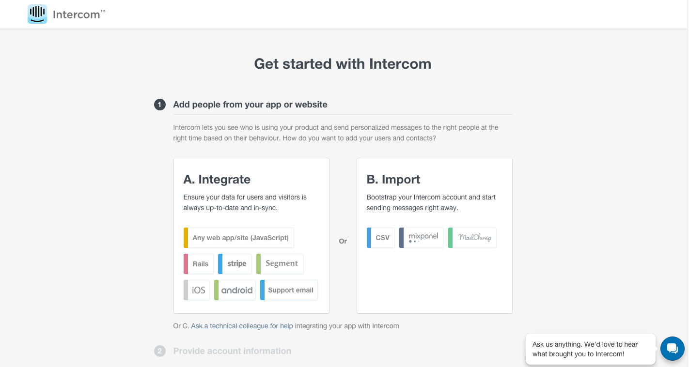
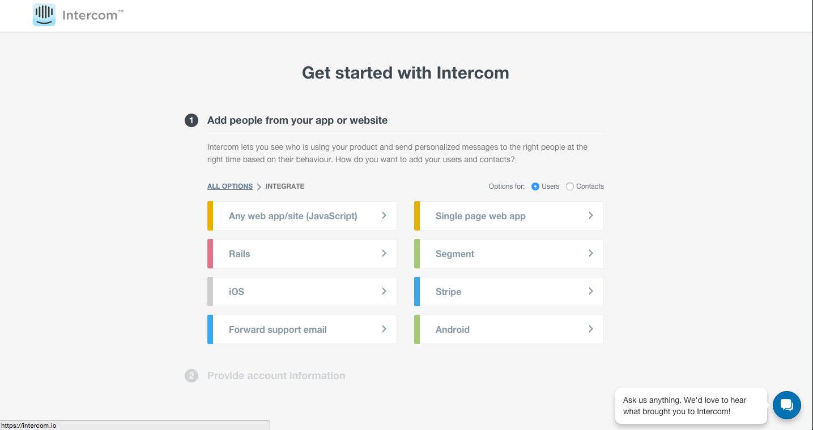
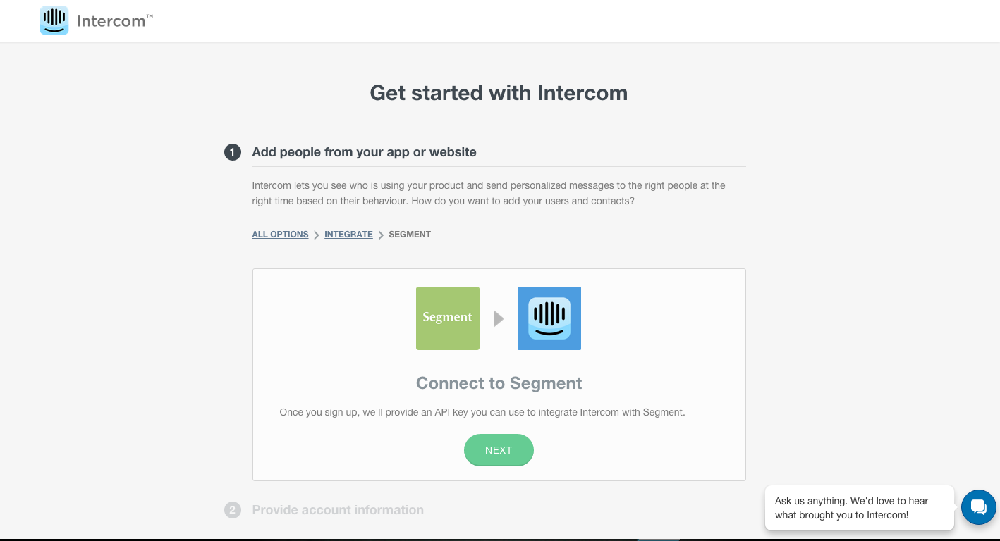
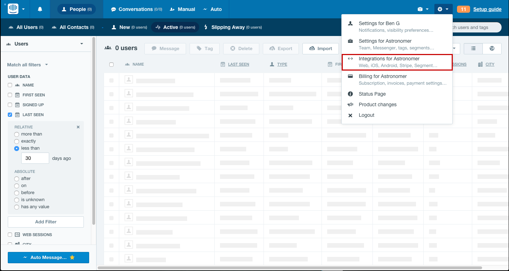
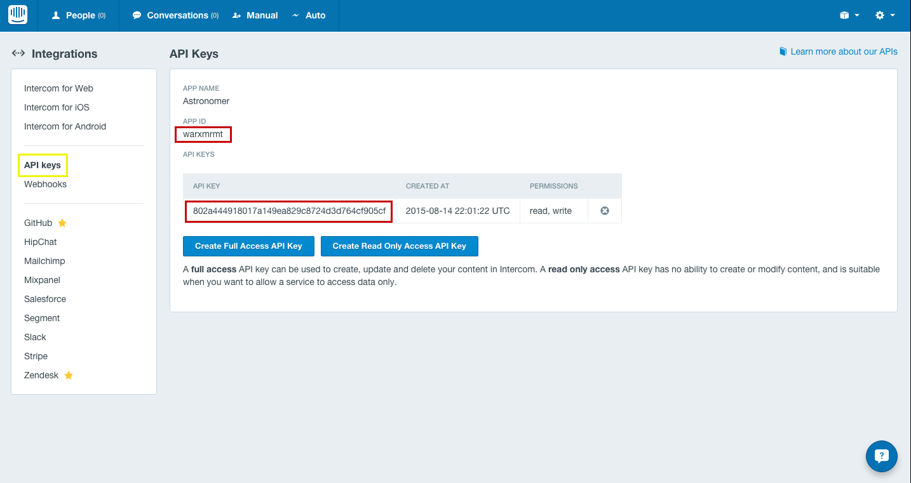
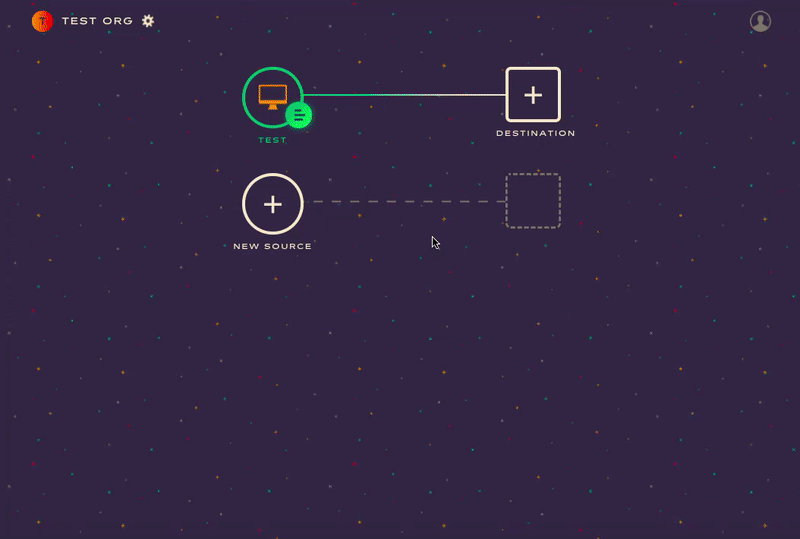
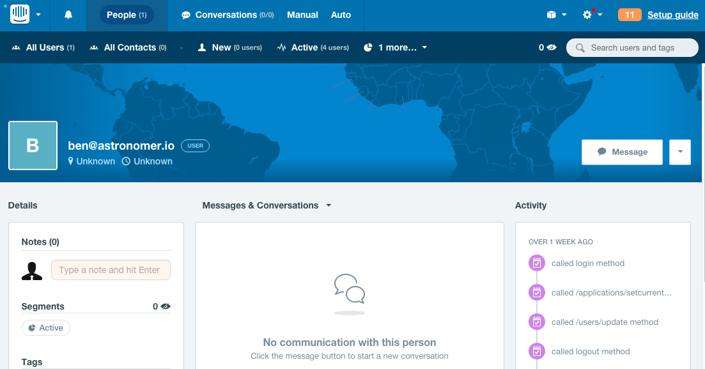

Astronomer Clickstream makes it easy to send your data to Intercom. Once you follow the steps below, your data will be routed through our platform and pushed to Intercom in the appropriate format.

## What is Intercom and how does it work?

Intercom is a customer messaging platform, providing in-app messaging for onboarding and support. It targets chat, email, and in-app messages based on user behavior.

Intercom requires that a JavaScript snippet be added to your site or that you use the appropriate SDK for iOS and Android. If you want to send data directly into Intercom, you'll need to implement custom event tracking in your site.

## Why send data to Intercom using Astronomer Clickstream?

Integrating Intercom with Astronomer allows you to immediately begin messaging customers based on their behavior. We also eliminate the need to home-brew a solution that tracks user events to Intercom.

## Getting Started with Intercom and Astronomer Clickstream

### Intercom Side

Once you're on the [Get started with Intercom](http://www.intercom.io) page, you'll be asked if you want to either integrate one of their libraries or import users from another service/csv.



Click on `Integrate` and then `Segment` (You're still setting up Astronomer, don't worry).



 Go ahead and click `Next` to continue the setup.



This is where you'll actually create your account and get started using Intercom.


Skip the `Set up Intercom & Segment` prompt and click on the gear wheel icon on the top right and then into the `Integrations` option in the dropdown.



From here, click on the `API Keys` on the left hand panel to access your Source ID and API Key. Your Source ID will look something like this: `9iefb489`.



### Astronomer Side

Enter your Source ID and API Key into the Intercom connector on your Astronomer dashboard.

Give your new connection a unique name.

Click `Create Destination` to activate your pipeline.



At this point, you'll see events coming in to your Intercom account. If you click on the `People` icon on the top of your dashboard, you'll see 1 new user. That's you!


Click on that new user to see the history of events being recorded.



### Additional Features

#### Disassociating Users from a Company (server-side only)

You can disassociate a user from a company by passing in a field inside the `company` trait with `remove: true` in your `identify` calls.

#### Identity verification plus filtering via Destinations Object

If you're using Intercom identity verification AND the `selective destinations functionality`, the context object will look like this:

```
{
     integrations: {
         All: false,
         Intercom: {
            user_hash: '<%= OpenSSL::HMAC.hexdigest("sha256", "YOUR_INTERCOM_APP_SECRET", current_user.id) %>'
         }
     }
}
```

#### Unsubscribe Users

With Astronomer Clickstream, you can unsubscribe users from email by setting a flag from `server side` libraries `unsubscribedFromEmails`, inside `context` object.

`node.js` example:

```
analytics.identify({
  userId: '4832094283057439285723523452345',
  anonymousId:'43254364571',
  context:{
    Intercom: { unsubscribedFromEmails: true }
  },
  traits: {
    firstName: 'John ',
    lastName: 'Jacob',
    email: 'jingleheimer@schmidt.com'
  }
});
```
***Note:** This will only work from server side libraries and mobile, NOT for analytics.js.*
