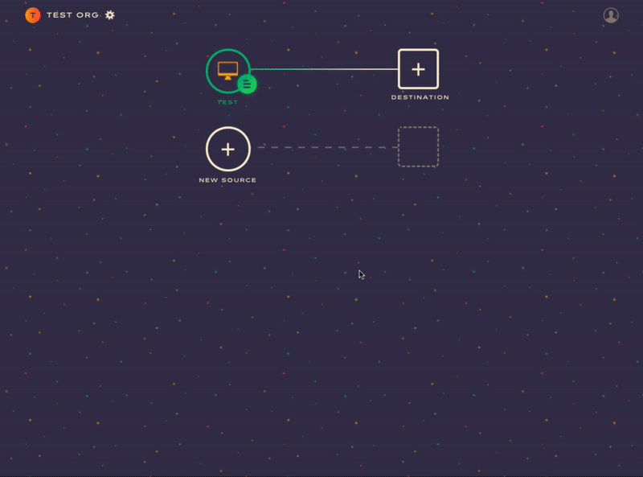

Astronomer Clickstream makes it easy to send your data to KISSmetrics. Once you follow the steps below, your data will be routed through our platform and pushed to KISSmetrics in the appropriate format. 

## What is KISSmetrics and how does it work?

KISSmetrics is a customer engagement automation suite that combines behavioral analytics, segmentation, and email campaign automation to deeply understand and engage your customers. It allows you to access "out-of-the-box" behavior reports across platforms, track your key growth segments, and deliver behavior-based automated emails to keep your users engaged. 

KISSmetrics also gives marketers insight into custom population behavior for both active and churned populations.

To install KISSmetrics itself, you have to : 

- 1. Map out the events and user traits to be collected
- 2. Decide which libraries and SDKs you need to collect that data 
- 3. Install them into your products. 

KISSmetrics event reporting is easy to use if your events are properly planned following best practices, but getting set up takes manual work and due diligence. 

[Learn more about KISSmetrics](https://www.kissmetrics.com/)

## Why send data to KISSmetrics using Astronomer Clickstream?

If you want to set up multiple analytics tools in your stack, going through this installation process individually for each one is probably not worth you're developers' time.

Using Astronomer to send data to KISSmetrics ensures that your developers only need to implement one platform and learn two simple calls: `identify` and `track`. With Astronomer, your customer data will not only be sent to KISSmetrics directly, but also to internal tools like email and chat. 

With Astronomer, skip the need for custom code and benefit from additional customer data. 

## Getting Started with KISSmetrics and Astronomer Clickstream

### KISSmetrics Side

Once you have a KISSmetrics account, get started sending events to KISSmetrics. You'll need your:

- Project ID
- Your Write Key
- API Key 

The Project ID is what tells Astronomer which project within KISSmetrics are yours and the Write Key gives Astronomer permission to send data into it. Both will be long strings of random characters (the ID will be 24 characters and the Write Key will be 224.)

See the below for more details on how to find your API key. This will be a 40 character string found in the JavaScript snippet that they suggest adding to your application. 

### Astronomer Side 

Now that you have your API Key, go ahead and enter it into the KISSmetrics connector on your Astronomer dashboard and give your new connection a unique name. 

Once that's done, click on `Create Destination` to activate your pipeline.

Click around your application to send off some test events. It might take an hour or so for events to start populating into your project. You can check to see if events are coming in by clicking on the `Live` tab at the top of the page and looking at the `All Activity` section.

