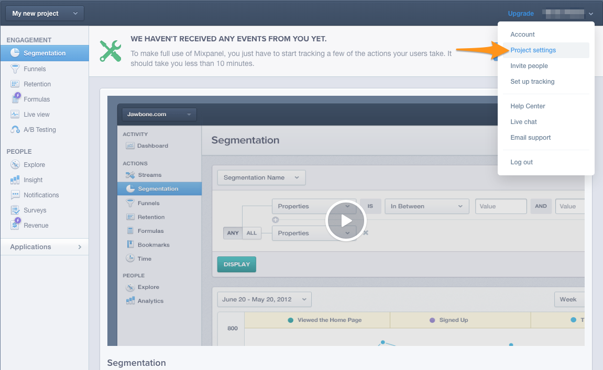
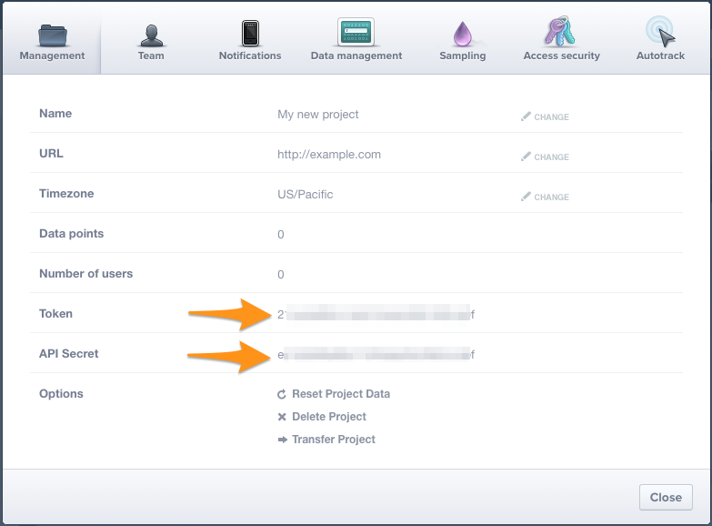

Astronomer Clickstream makes it easy to send your data to Mixpanel. Once you follow the steps below, your data will be routed through our platform and pushed to Mixpanel in the appropriate format.

## What is Mixpanel and how does it work?

Mixpanel, geared towards financial services, SaaS, consumer tech, and media/entertainment, is a product analytics tool for product people. The tool analyzes customer-drive data, allowing your team to deeply understand every user's journey with instant insights for everyone on mobile and web.

Mixpanel creates funnel reports to identify user drop off or churn risk, allows for immediate A/B testing and experimentation, supports JSQL, and brings you automated insights that let non-technical users skip the data-mining.

[Learn more about Mixpanel](https://mixpanel.com/)

## Why send data to Mixpanel using Astronomer Clickstream?

Implementing Mixpanel without Astronomer involves building with two separate APIs - Mixpanel and Mixpanel People. In this case, you'd need to indicate which user traits and events that you want to be collected and send them to the appropriate SDKs.

Integrating Mixpanel with Astronomer Clickstream, however, means that you don't need to work with any of Mixpanel's APIs or SDKs.

Once you enable Mixpanel in your Astronomer UI, we'll route your data directly to Mixpanel in a compatible format so you can skip native implementation and save time for insights.

## Getting Started with Mixpanel and Astronomer Clickstream

### Mixpanel Side

Once you've made a Mixpanel account and find yourself on the site, go ahead to project settings. Here, you'll find your Token and API key.

You'll need to copy these two fields into the Astronomer App configuration for Mixpanel.

### Astronomer Side

Now, head over to your Astronomer dashboard and insert both your Token and API key into the Mixpanel destination.

Give your pipeline a unique name, and click `Create Destination` to officially activate it.

With that, you're set! Your data should start flowing almost immediately.

Click on `View Your Data` back in the Mixpanel UI to start exploring.

### Additional Features

On top of our standard calls, you're free to do a few extra things with our Mixpanel integration:

- `Enable Mixpanel People`: This will enable all of your analytics.identify() calls to get sent to Mixpanel's People.
    * `Events to Increment in People` - Used for segmenting users by event counts and last event date in Mixpanel People. List the events that you want to see in Mixpanel People here.
    * `Add People Properties` - These are set off of `identify` API calls and allow you to explicity set properties that you want to track.
    * `Add Super Properties` - This lets you explicitly set the super properties that you wish to track.

*Note that, if `Set All Traits by Default` is enabled, you will not need to specify explicit people or super properties.*

- By default, we will track all pages to Mixpanel with a consolidated event name. This sends all `page` and `screen` calls as `Loaded a Page` or `Loaded a Screen` events. If you wish to do this in a different way, disable the `Consolidate Page Calls` option and see the additional options below. 

- *Track additional pages*, including:
    * `Named Pages` - This sends a `Viewed (name) Page` event to Mixpanel.
    * `Categorized Pages` - This sends a `Viewed (category) Page to Mixpanel.
    * `All Pages` - This causes all `page` calls to be sent to Mixpanel, regardless of how you have customized your pages. They will appear as `Loaded A Page` in Mixpanel.

- Cookies
    * `Add Cross Subdomain Cookie` - Allows Mixpanel cookiec to be read across all subdomains.
    * `Secure Cookie` - This marks the Mixpanel cookie as `secure`, meaning that this cookie will only be transmitted over https.
    * `Persistence Cookie` - This allows the Mixpanel cookie to persist between two separate pages of your application.

- Geolocation
    * To stop geolocation from occuring based on the IP of your server side calls, add `ignoreIp: true` to the context of your `identify`, `track`, and `alias` calls. This will prevent ip and location from being updated in Mixpanel.
  
