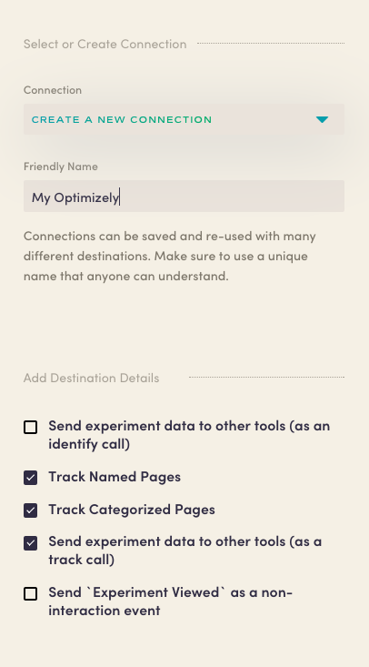

Astronomer Clickstream makes it easy to send your data to Optimizely. Once you follow the steps below, your data will be routed through our platform and pushed to Optimizely in the appropriate format. 

## What is Optimizely and how does it work?

Optimizely is an A/B testing and experimentation tool that allows you to run multivariate experiments across web and mobile web. There is also iOS and Android integration that allows you to run similar experiments on your mobile apps. All of the informatiomn gathered from your experiments is presented by Optimizely in a "Stats Engine" dashboard that monitors perfomance and statistical significance so that your decision is made easy.

Optimizely is installed client-side by adding a snippet directly into your site's code. Once this snippet is added, you can start running experiments for the web and install the Optimizely SDK for mobile experimentation. For web-based experiments, each project must ahve its own unique line of javascript placed in the `<head>` of your site. If you want to send conversion events directly into Optimizely, you'll need to implement duplicate event tracking alongside advertising pixels, email marketing tools, analytics tools, and attributuon tools.

## Why send data to Optimizely using Astronomer Clickstream?

When you use Optimizely with Astronomer Clickstream, all `track` calls are automatically sent as potential conversion events for your experiments. Also, by generating a `track` call when any Optimizely experiment runs, Astronomer allows you to extend an experimental message to be consistent in downstream email marketing tools. This also means that you can do deeper funnel analysis in analytics tools or your data warehouse which will allow you to realize the full impact of your experiments.

## Getting Started with Optimizely and Astronomer Clickstream

Our Optimizely connector allows you to send events directly into Optimizely.  From there, you can record your Optimizely experiments or campaigns back into Astronomer, enabling you to analyze Optimizely data inside any other enabled tools within your Astronomer application.

This connector supports either Classic, Optimizely X, or both.

Note that the Optimizely `<script>` tag needs to be on the page right away (Astronomer can’t load its client side library for you). In order to broadcast events, you must embed the Optimizely `<script>` tag in the `<head>` element on your page <b>before</b> the Astronomer snippet.

See [this instructional video by Optimizely](https://help.optimizely.com/Set_Up_Optimizely/Implement_the_snippet_for_Optimizely_Classic) to find and embed their JavaScript snippet.  You'll want to include this snippet on every page you want to run experiments on (and remember, BEFORE the Astronomer snippet!). This connector supports client-side analytics.js (no server-side, iOS, or Android analytics).

To begin, create an [Optimizely](https://www.optimizely.com/) account, retreive your [JavaScript snippet](https://help.optimizely.com/Set_Up_Optimizely/Implement_the_snippet_for_Optimizely_Classic), and embed the snippet in each page that you want to run experiments on (remember, BEFORE the Astronomer snippet!).

Within your Astronomer configuration, add the Optimizely destination connector, and give your new connection a unique name. 

Then, configure the Optimizely connector to support your desired features.  The steps for this will vary depending on whether you're deploying [Optimizely Classic](https://help.optimizely.com/Measure_success%3A_Track_visitor_behaviors/Custom_event_goals_in_Optimizely_Classic) or [Optimizely X Web](https://help.optimizely.com/Build_Campaigns_and_Experiments/Custom_events_in_Optimizely_X).

### Additional Features

#### Send experiment data to other tools (as an identify call)
This is not recommended because if you’re running lots of experiments, this could lead to lots of unwanted properties in end tools, in addition to unwanted columns in Astronomer-connected databases.

#### Track Named Pages
This will track events to Optimizely for page method calls that have a name associated with them. 

#### Track Categorized Pages
This tracks events to Optimizely for page calls that have a category associated with them. 

#### Send experiment data to other tools (as a track call)
Sends the experiment and variation information as properties on a track call.

#### Send `Experiment Viewed` as a non-interaction event
Specifies the Experiment Viewed as a non-interaction event for Google Analytics

Click 'Create Destination' and your pipeline will be activated. 
