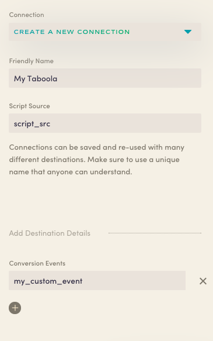

Astronomer Clickstream makes it easy to send your data to Taboola. Once you follow the steps below, your data will be routed through our platform and pushed to Taboola in the appropriate format. 

## What is *Taboola*?

Taboola develops and markets a service for online content publishers and advertisers that recommends digital content to website users. 

## Why send data to *Taboola* using Astronomer Clickstream?

Astronomer Clickstream data will inform your Taboola platform, empowering you to better understand your users and more effectively provide your users with engaging digital content. 

## Getting Started with Taboola and Astronomer Clickstream

To get started sending events to Taboola, you'll need your script source, which you'll see as soon as you [create your Taboola conversion tracking code](https://help.taboola.com/hc/en-us/articles/115006164967-Creating-Your-Conversion-Tracking-Code).

*Note:* This connector supports client-side analytics.js only.  You also need to have instrumented Astronomer [inside your website](https://docs.astronomer.io/docs/1.0/streaming/clickstream/collectors/analyticsjs/) prior to enabling this connector.

### Taboola Side

You can find your script source inside of your conversion tracking code, shown as `ScriptSrc` below:

``` javascript
<script src="//cdn.taboola.com/libtrc/ScriptSrc/tfa.js"></script>
```

### Astronomer Side

Copy your `ScriptSrc` and paste it into the "Script Source" field in your Astronomer Taboola configuration. 

Give your new connection a unique name and click `Create Destination` to activate your pipeline. 

*Note:* You can specify custom event names in the Conversion Events section, shown as `my_custom_event` in the example below.




With that, you're all set. Get ready for insights. 
