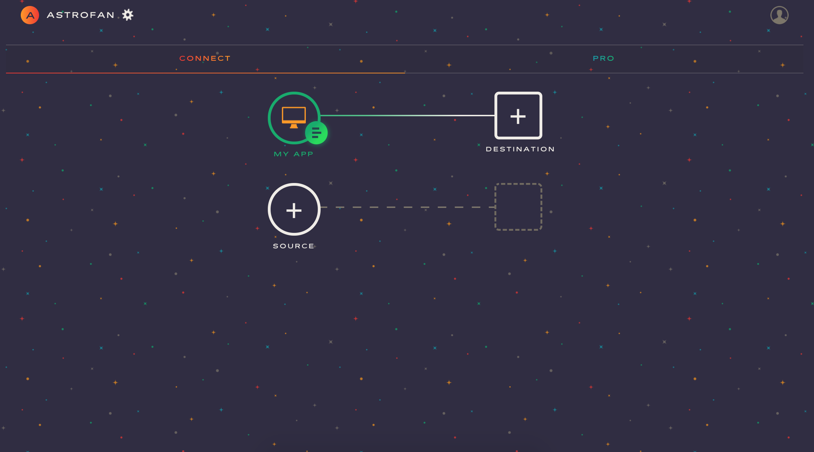
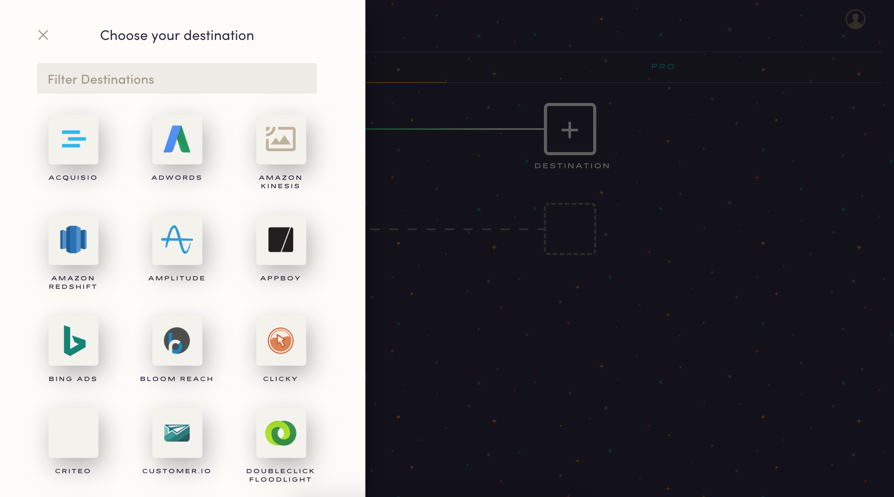
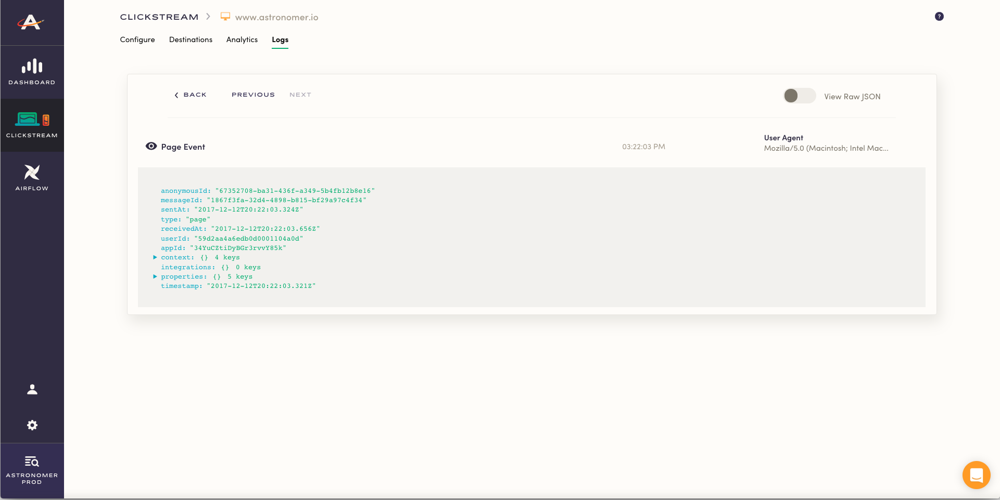
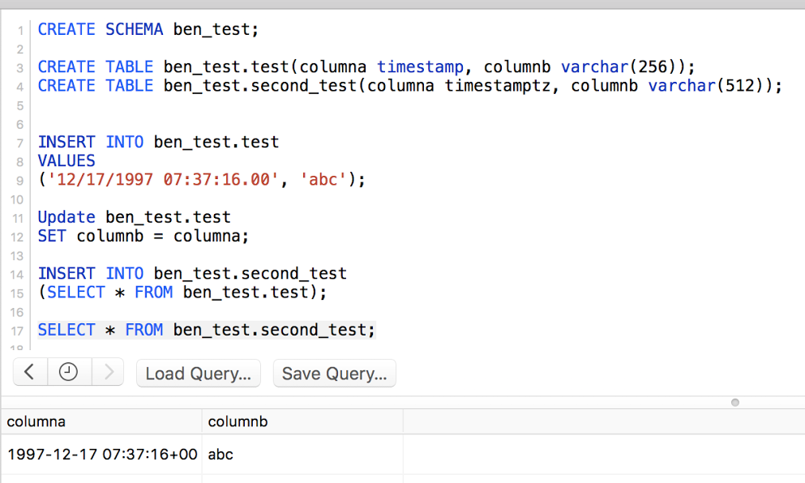
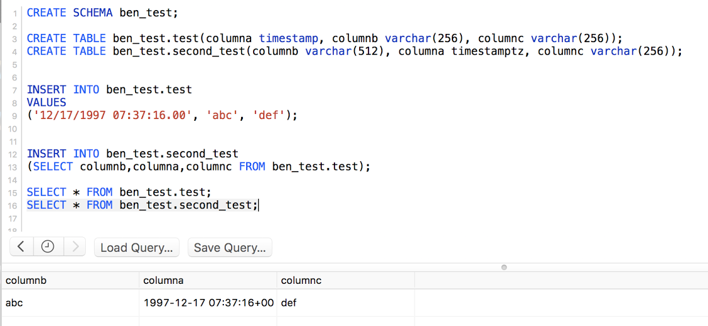

# Switching from Segment

While Segment has standardized real-time, vendor-neutral customer event collection, no platform is a perfect fit for everyone. At Astronomer, we've provided an alternative for those searching for greater flexibility, improved security and event-based pricing.

Switching from Segment to Astronomer is very simple. Follow the four easy steps below to get up and running with our platform!

### Step 1

[Sign up for Astronomer](https://app.astronomer.io/signup) and create a [source](https://docs.astronomer.io/v2/clickstream/sources/overview.html) in the Astronomer UI.



### Step 2

Remove your Segment snippet and replace it with our [analytics.js](https://docs.astronomer.io/v2/clickstream/sources/analyticsjs.html) snippet: 
```js
<script type="text/javascript">
  !function(){var analytics=window.analytics=window.analytics||[];if(!analytics.initialize)if(analytics.invoked)window.console&&console.error&&console.error("Astronomer snippet included twice.");else{analytics.invoked=!0;analytics.methods=["trackSubmit","trackClick","trackLink","trackForm","pageview","identify","reset","group","track","ready","alias","page","once","off","on"];analytics.factory=function(t){return function(){var e=Array.prototype.slice.call(arguments);e.unshift(t);analytics.push(e);return analytics}};for(var t=0;t<analytics.methods.length;t++){var e=analytics.methods[t];analytics[e]=analytics.factory(e)}analytics.load=function(t){var e=document.createElement("script");e.type="text/javascript";e.async=!0;e.src=("https:"===document.location.protocol?"https://":"http://")+"cdn.astronomer.io/analytics.js/v1/"+t+"/"+t+".js";var n=document.getElementsByTagName("script")[0];n.parentNode.insertBefore(e,n)};analytics.SNIPPET_VERSION="3.1.0";
  analytics.load("YOUR_SOURCE_ID");
  analytics.page()
  }}();
</script>
```

### Step 3

Step 3: Configure your integrations via the Astronomer dashboard.



### Step 4

Step 4: Check the live debugger to make sure your data is flowing.



# Segment | Astronomer Merge Guidelines

You've made the switch from Segment to Astronomer Clickstream and now you want all of your data in one place (including the data from your old Segment account). Merging is an easy process - we’ll walk you through it.


## Initial Column Audit

To start, we'd recommend that you take a few minutes to review your existing Segment tables with the tables created by Astronomer's Clickstream platform. Create a spreadsheet with tables from both platforms side by side to easily identify datatype conflicts. 

Here's the SQL to view that information:

```sql
SELECT * FROM information_schema.columns
WHERE table_schema = 'example_schema_name'
AND table_name = 'example_table_name'
```

## Datatype Conflicts

If you do identify some datatype conflicts, it's likely that your destination column will be able to accommodate the previous datatype (e.g. varchar(256) or varchar(512) or timestamp with timezone. Check out the following example:



## Non-Existent Destination Columns

If you have some columns that don't exist in the destination tables, they'll need to either be dropped from the source (Segment) tables or added manually to the destination tables. 

You can do the latter manually via the [Alter Table Add Command](http://docs.aws.amazon.com/redshift/latest/dg/r_ALTER_TABLE.html).

## Differing Ordinal Positions

If the ordinal position differs between the two tables, a Bulk Insert ((e.g. `INSERT INTO {DESTINATION_TABLE} (SELECT * FROM SOURCE_TABLE}`) is slightly more complicated.

From here, you'll have 2 options: 

**A) Bulk Insert**

Here, use the specific column order as the destination tables rather than`SELECT` (see below)



**B) Unload to S3 and then Copy**

This has a few more steps, but will likely be less taxing on your db depending on your row count. 

1. [Unload each source table to S3](http://docs.aws.amazon.com/redshift/latest/dg/r_UNLOAD.html)

2. [COPY each file from S3 into the corresponding destination table](http://docs.aws.amazon.com/redshift/latest/dg/r_COPY.html)

Here, you can specify the column order of the destination table that the file should load into. 


Please don't hesitate to contact us with any questions as you get set up! You can reach us anytime at support@astronomer.io.