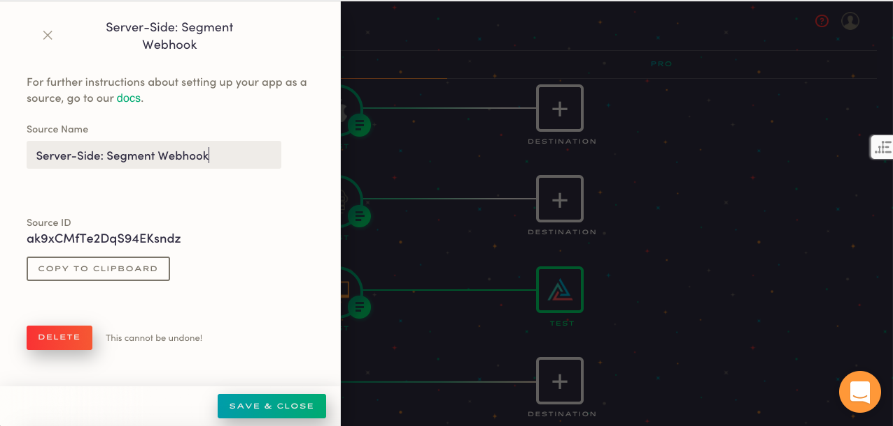

## Getting data from Segment into Astronomer Clickstream

If you'd like to get your data from Segment to Astronomer, you can do this through our webhook API. Follow the instructions below to make this happen.

Begin by creating a server-side source in your Astronomer app. There, you'll find a `Source ID`, which is a long string of letters and numbers.

 

In your Segment UI, add a `Web Hook` integration. You can filter by integrations to "raw data" to expedite this process. Once you've created this destination, paste in this URL: `https://api.astronomer.io/v1/webhook?appId=YOUR_SOURCE_ID`, substituting `YOUR_SOURCE_ID` with the `Source ID` from your source settings.

Once you configure a destination, you can now trigger some events and confirm that they're flowing from Segment to Astronomer via the log screen in your Astronomer UI.

